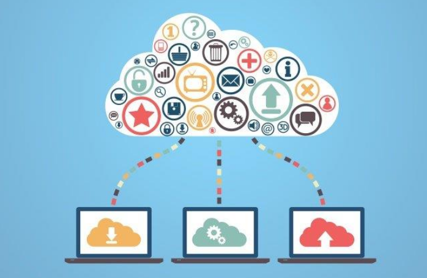

## Cloud computing: What is it and what are its implications?

Cloud computing is the provison of technology services such as servers analysis, network administration, database, information storage, and software through internet systems. Cloud providers charge according to the package.
To establish an excellent relationship with a partner or provider, you will need advice to help you make the right decision. We will discuss this later, but first, learn about the scope of cloud computing. Its schemes, and classification by services.

### Cloud computing: What is its scope?

Although some users find it easy to understand technology issues, other consumers need more information and support. You may not yet be claer about the concept of cloud computing, so we will explain it with some basic examples.