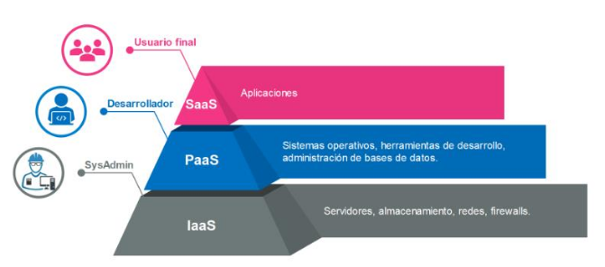
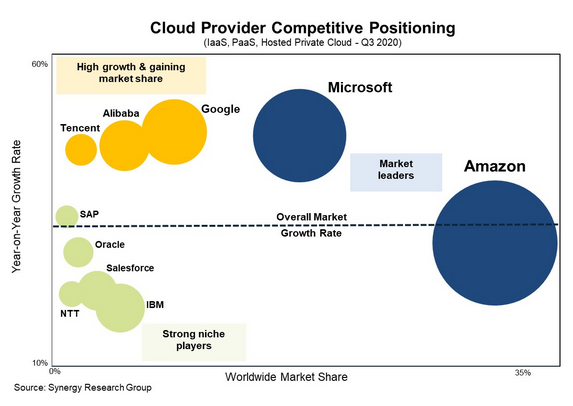

## What is Cloud Computing?
Cloud computing is amodel for delivering and consuming services on demand. The growth of cloud computinghas been exponential, leading to the development of service and implementation models to meet user needs. This is why terms such as private cloud, public vloud, hydrid cloud, IaaS, PaaS, and SaaS have emerged and are often heard. In this article, we will discuss these concepts and more, explaining the types of clouds, the main service models, examples of services, providers, and useful tools.

### Types of Cloud Computing
As i just mentioned, implementation models have been developed, commonly known as types of cloud or types of cloud computing. Initially, these models were devided into two categories: private clouds and public clouds. However, other types of clouds have emerged that are simply a combination of one or both of the previous models. Iam referring to hybrid clouds and multiple clouds or multiclouds.

### What is a public cloud
This is the most common type of cloud computing. With the public cloud model, resources (computing power, storage, databases, development platforms, applications, etc.) are offered on demand and immediately via the internet. The underlying resources, hardware, software, and everything realted to the physical infraestructure are owned by the provider, who is responsible for maintenance and administration. In the public cloud, you can implement any application, experiment, migrate your entire data center-in short, the possibilities are endless.

This model allows developers, system asministrators, and businesses in general to focus on what matters most to the business, avoiding IT capacity planning, hardware procurement and management, and other IT department tasks.

AWS, Microsoft Azure, and Google Cloud Platform are examples of public clouds. We will discuss the main providers later on.

### What is a private cloud
As you can understand, in the public cloud model, the customer must entrust part of the security to the provider. Some companies do not trust the security of a third party or believe that they should have total control of their environment with their own team and infrastructure. For this reason, the need arose to replicate the model in private environments, in the company's data centers. This way, the benefits of cloud computing, such as agility, automation, scalability, etc., are achieved, but on the company's own premises. Therefore, a private cloud is composed of computing resources used solely by one institution, the infrastructure is always maintained on a private network, and the hardware and software are dedicated to the organization itself.

It should be clear that a private cloud is not the same as a local infrastructure with traditional virtualization; it must meet certain cloud computing characteristics. OpenStack, openNebula, and CloudStack are open-source alternatives for implementing this model.

### What is a hybrid cloud
A hybrid cloud is a combination of two different types (public cloud and private cloud), which are perceived as separate entities but are linked by standardized technology, facilitating communication and the portability of data and applications. The aim is to combine the two implementation models and get the best of both. Some companies have a private cloud that works perfectly and has reached a high degree of maturity. However, they need to obtain more resources than they are capable of producing, so they need a third party (public cloud provider) to maintain efficiency. This is when integration takes place, resulting in a hybrid model.

### What is multicloud
Lately, it is more common to find this type of implementation in companies. It is the combination of two or more cloud implementations of the same type (public or private). Therefore, we can combine services from different cloud providers. For example, you have your infrastructure and applications with a public cloud provider, but over time you need certain applications or functionalities that your customer demands and that your provider does not offer, but which are available from another provider. In that case, it would not be ideal to migrate your entire infrastructure. The right thing to do would be to deploy another environment that meets your needs and thus work with a multicloud implementation. It also serves to provide high availability, which you already have with a provider's regions and availability zones, but imagine what it would be like to have resources at two different providers.

### Cloud Computing Services
In addition to Cloud Computing implementation models or cloud types, we have Cloud Computing service models that allow you to choose the level of control, flexibility, and information management. Traditionally, three main types of cloud computing services are defined: IaaS, PaaS, and SaaS.

In the following illustration, you can see a graphic representation to differentiate the layers and a summary of what each service model provides us with. But we will explain each one individually.

### What is IaaS
Infrastructure as a service (IaaS) is mainly used by system administrators. Fundamental resources, networks, servers, storage, and firewalls are provided, all in service mode. In this model, as a customer, you have greater control over the information, since you can implement and run software according to your preferences. You do not control the underlying infrastructure; however, from the virtualization layer onwards, you own everything and have control over the operating system, storage, and applications. A clear example is when we implement an application on a virtual machine or instance from scratch. Of course, having more control comes with greater responsibility. You will be responsible for the administration and security of the virtual machine, installing security patches, configuring access rules, etc.

### What is PaaS
Platform as a service (PaaS) is mainly used by software developers. In principle, it involves an additional level of abstraction above IaaS. In this model, the provider guarantees the operating system, programming languages, libraries, and tools. It is a complete and scalable platform, where developers only have to worry about the application code. You should be aware that with PaaS, you do not manage or have control over the underlying infrastructure, including the virtual machine layer, operating systems, and storage. However, you have full control over your deployed applications and, in some cases, you will have access to some environment configuration settings.

### What is SaaS
Software as a service (SaaS) provides a complete product offered by the provider, who is responsible for its administration. With this model, you don't have to worry about the cloud infrastructure, nor do you need to know how the service is maintained. You just have to consume the service, so the only task is to learn how to use it. These applications are accessible via the Internet and from any device, using a client that can be a web browser. We can say that they are end-user applications.

### Examples of cloud computing
Below is a list of cloud services classified according to service model. Obviously, there are more examples—enough to fill a book. So, I will mention those that are probably best known and most widely used.

<b>Example of IaaS</b>

* AWS
* Microsoft Azure
* Google Cloud Platform
* OpenStack

Just to mention a few specific examples of IaaS that we find with these clouds, Amazon EC2 and Azure virtual machines, but really the catalog of these types of services is extensive.

<b>Example of PaaS</b>

* AWS Elastic Beanstalk
* Azure App Service
* Google App Engine
* Red Hat OpenShift
* CloudFountry
* Heroku

<b>Example of SaaS</b>

* Microsoft Office 365
* Google web applications
* Slack messaging service

### Cloud Computing Providers
The demand for cloud computing is enormous, with more and more companies migrating to the cloud. In this section, we will discuss the main cloud providers so that you can learn about the available alternatives and carry out your implementations. To provide some context, here is an interesting piece of data from Synergy Research Group showing the growth and competitive positioning of public cloud providers.
This report is from October 2020.

### Amazon
Amazon Web Service (AWS) was the first to offer cloud infrastructure services to businesses, and as a pioneer, it is one of the best known and fastest growing. In the image above, you can see that it remains in first place. AWS provides a reliable cloud platform used by thousands of companies around the world. If you log into the AWS management console, you will surely be surprised by the number of services and tools available, and most importantly, it continues to grow.

### Microsoft
Microsoft took a little longer to enter the market with its solution, Microsoft Azure. However, it has grown rapidly and on a large scale. Like AWS, it is a public cloud provider offering different services. An important feature is that it offers services in the three main cloud layers (IaaS, PaaS, SaaS). Competition is very good because they empower each other, always trying to bring out new products or improve existing ones.

### Google
Google is also a public cloud provider and offers cloud computing solutions through its platform, Google Cloud Platform (GCP). It seems to have struggled to compete with other providers, but in recent years it has grown rapidly and is now widely used by large companies.

### OpenStack
You have probably noticed that OpenStack does not appear in the image above. Indeed, it is not there; there are only public cloud providers. Therefore, I think it is important to mention OpenStack in this section, since we are discussing all types of clouds. If you want to implement a private cloud, OpenStack is a great option. It is a cloud computing infrastructure software project, it is open source, and it is one of the most active open source projects in the world.

### Cloud Computing Tools
In this section, I would like to take the opportunity to mention some important tools for working in the cloud and getting the most out of it, mainly those that help automate processes and treat infrastructure as code. There are many tools, some geared toward a specific type of cloud or provider. However, I want to share the most versatile ones, meaning they can be used for any implementation of an environment with any cloud provider. If you want to exploit the advantages of cloud computing, you must know and learn how to use these four tools:

* Terraform
* Ansible
* Docker
* Kubernetes

Fortunately, you won't have to look too far. At OpenWebinars, you'll find comprehensive courses on the tools mentioned above. I invite you to browse through the course catalog.

### Conclusion
Cloud Computing offers many benefits, such as agility, flexibility, pay-per-use, globalization, scalability, and, of course, automation. We have explained the different Cloud Computing models, the main cloud providers, and useful tools. At this point, it is normal to have questions. Which type of cloud computing is most suitable? What type of service should you use? Which provider should you choose? There is no absolute truth to these questions, but I believe that the best answer is to use whatever best meets the needs of your business. Therefore, it is necessary to research and experiment in order to gather enough information to plan your solutions.

Cloud computing is one of the fields with the brightest future in IT, and demand for specialists continues to grow, so training in this area is a great idea. If you want to get started on the right foot, we recommend taking this course, which is perfect for learning about related technologies and the fundamentals of cloud computing.